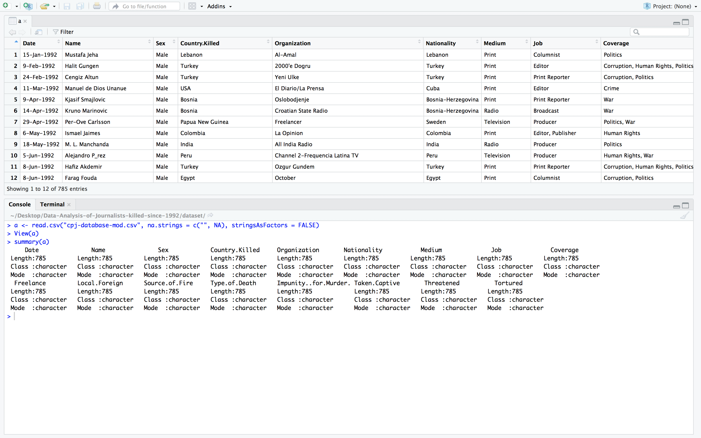
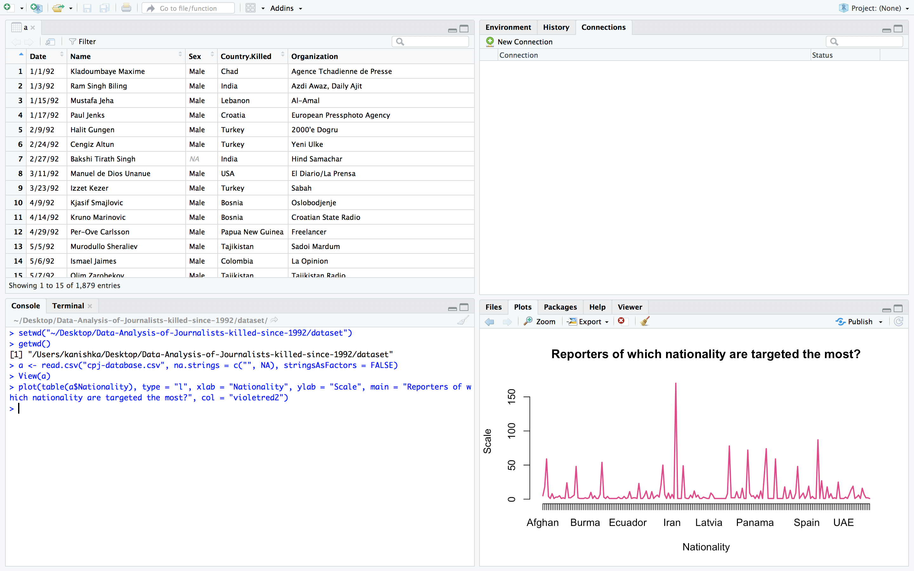
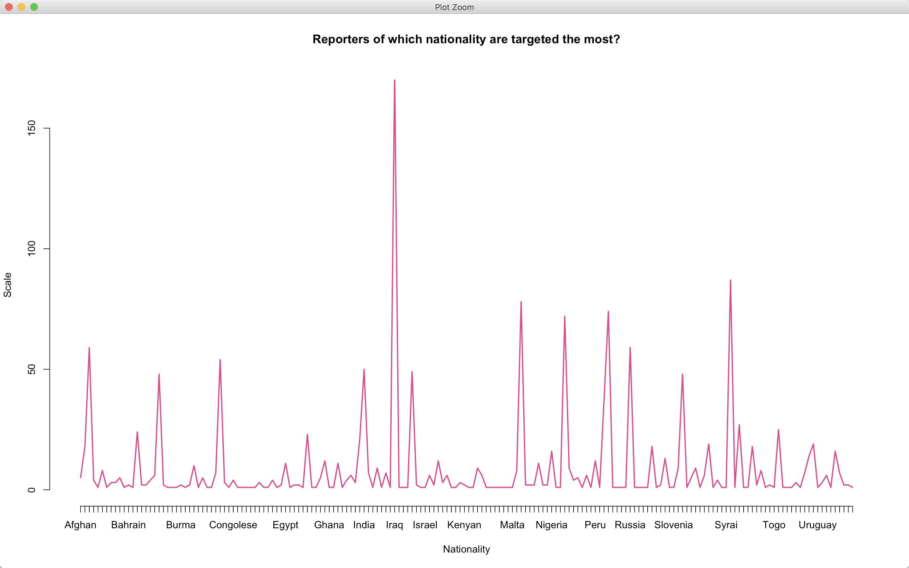
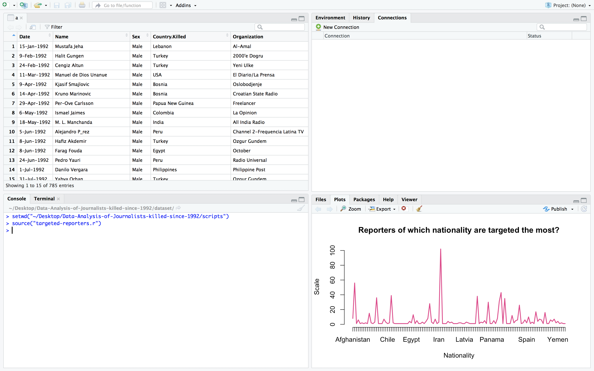
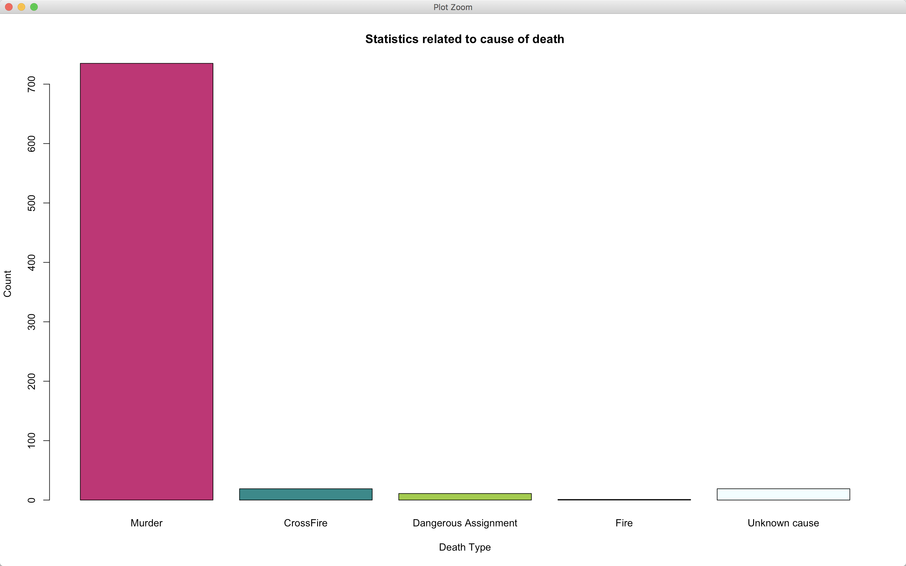
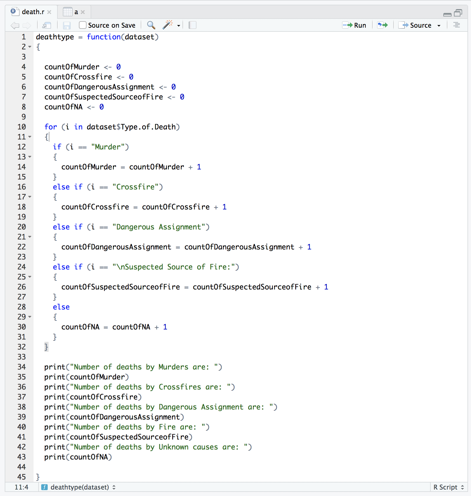

# :gun: Journalists that have been killed since 1992, compiled by CPJ

###### Index

- [Data Set Source](#data-set-source)
- [Cleaning](#cleaning)
- [Statistics of the data](#statistics-of-the-data)
- [Visualization](#visualization)

----

###### Data Set Source

- [journalist-deaths](https://data.world/journalism/journalist-deaths)

----

###### Cleaning

- **Remove unwanted columns**

```r
> setwd("~/Desktop/r-project")
> getwd()
[1] "/Users/kanishka/Desktop/r-project"
> a <- read.csv("cpj-database.csv", na.strings = c("", NA), stringsAsFactors = FALSE)
> View(a)
> keepColumns <- c(1,2,3,4,5,6,7,8,9,10,11,12,13,14,15,16,17)
> a2 <- a[,keepColumns]
> View(a2)
> 
```


- **Removal of `blanks values` and `na`**

```r
> setwd("~/Desktop/r-project")
> getwd()
[1] "/Users/kanishka/Desktop/r-project"
> a <- read.csv("cpj-database.csv", na.strings = c("", NA), stringsAsFactors = FALSE)
> View(a)
> keepColumns <- c(1,2,3,4,5,6,7,8,9,10,11,12,13,14,15,16,17)
> a2 <- a[,keepColumns]
> View(a2)
> a3 <- na.omit(a2)
> View(a3)
> 
```


- **Splitting columns**

```r
> write.csv(a3, file = "cpj-database.csv",row.names=TRUE)
```

```r
> setwd("~/Desktop/r-project")
> getwd()
[1] "/Users/kanishka/Desktop/r-project"
> a <- read.csv("cpj-database-mod.csv")
> View(a)
> a4 <- separate(a, Date, c("day", "month", "year"), sep = "-")
> View(a4)
> 
```


----

###### Statistics of the data

```r
> a <- read.csv("cpj-database-mod.csv", na.strings = c("", NA), stringsAsFactors = FALSE)
> View(a)
> summary(a)
     Date               Name               Sex            Country.Killed     Organization       Nationality           Medium              Job              Coverage        
 Length:785         Length:785         Length:785         Length:785         Length:785         Length:785         Length:785         Length:785         Length:785        
 Class :character   Class :character   Class :character   Class :character   Class :character   Class :character   Class :character   Class :character   Class :character  
 Mode  :character   Mode  :character   Mode  :character   Mode  :character   Mode  :character   Mode  :character   Mode  :character   Mode  :character   Mode  :character  
  Freelance         Local.Foreign      Source.of.Fire     Type.of.Death      Impunity..for.Murder. Taken.Captive       Threatened          Tortured        
 Length:785         Length:785         Length:785         Length:785         Length:785            Length:785         Length:785         Length:785        
 Class :character   Class :character   Class :character   Class :character   Class :character      Class :character   Class :character   Class :character  
 Mode  :character   Mode  :character   Mode  :character   Mode  :character   Mode  :character      Mode  :character   Mode  :character   Mode  :character  
> 
```



----

###### Visualization

- **Gender wise distribution of journalist deaths over the years**

```r
> setwd("~/Desktop/r-project")
> getwd()
[1] "/Users/kanishka/Desktop/r-project"
> a <- read.csv("cpj-database-mod.csv")
> View(a)
> a4 <- separate(a, Date, c("day", "month", "year"), sep = "-")
> View(a4)
> ggplot(a4, aes(x = year, fill = Sex)) + theme_bw() + geom_bar() + labs(y = "Count", title = "Gender wise distribution of journalist deaths over the years")
> 
```


`gender-wise-dist.r`

```r
setwd("../dataset/")
getwd()
library(tidyr)
library(ggplot2)
a <- read.csv("cpj-database-mod.csv")
View(a)
a4 <- separate(a, Date, c("day", "month", "year"), sep = "-")
View(a4)
plot <- ggplot(a4, aes(x = year, fill = Sex)) + theme_bw() + geom_bar() + labs(y = "Count", title = "Gender wise distribution of journalist deaths over the years")
print(plot)
```

```r
> setwd("~/Desktop/Data-Analysis-of-Journalists-killed-since-1992/scripts")
> source("gender-wise-dist.r")
```


- **Are foreign journalists targeted more than local journalists?**

```r
> setwd("~/Desktop/r-project")
> getwd()
[1] "/Users/kanishka/Desktop/r-project"
> a <- read.csv("cpj-database-mod.csv")
> View(a)
> a4 <- separate(a, Date, c("day", "month", "year"), sep = "-")
> View(a4)
> local_and_foreign <- table(a4$Local.Foreign)
> View(local_and_foreign)
> pie(local_and_foreign, main = "Are foreign journalists targeted more than local journalists?", col = c('azure', 'darksalmon', 'cyan2'))
> 
```


`are-foreign-journalists-targeted.r`

```r
setwd("../dataset/")
getwd()
library(tidyr)
a <- read.csv("cpj-database-mod.csv")
View(a)
a4 <- separate(a, Date, c("day", "month", "year"), sep = "-")
View(a4)
local_and_foreign <- table(a4$Local.Foreign)
View(local_and_foreign)
pie(local_and_foreign, main = "Are foreign journalists targeted more than local journalists?", col = c('azure', 'darksalmon', 'cyan2'))
```

```r
> setwd("~/Desktop/Data-Analysis-of-Journalists-killed-since-1992/scripts")
> source("are-foreign-journalists-targeted.r")
```


- **Reporters of which nationality are targeted the most?**

```r
> setwd("~/Desktop/Data-Analysis-of-Journalists-killed-since-1992/dataset")
> getwd()
[1] "/Users/kanishka/Desktop/Data-Analysis-of-Journalists-killed-since-1992/dataset"
> a <- read.csv("cpj-database.csv", na.strings = c("", NA), stringsAsFactors = FALSE)
> View(a)
> plot(table(a$Nationality), type = "l", xlab = "Nationality", ylab = "Scale", main = "Reporters of which nationality are targeted the most?", col = "violetred2")
> 
```





`targeted-reporters.r`

```r
setwd("../dataset/")
getwd()
a <- read.csv("cpj-database-mod.csv")
View(a)
plot(table(a$Nationality), type = "l", xlab = "Nationality", ylab = "Scale", main = "Reporters of which nationality are targeted the most?", col = "violetred2")
```

```r
> setwd("~/Desktop/Data-Analysis-of-Journalists-killed-since-1992/scripts")
> source("targeted-reporters.r")
```



- **Statistics related to cause of death**

```r
> setwd("~/Desktop/Data-Analysis-of-Journalists-killed-since-1992/dataset/")
> getwd()
[1] "/Users/kanishka/Desktop/Data-Analysis-of-Journalists-killed-since-1992/dataset"
> a <- read.csv("cpj-database-mod.csv", na.strings = c("", NA), stringsAsFactors = FALSE)
> View(a)
> source("../scripts/death.r")
> deathtype(a)
[1] "Number of deaths by Murders are: "
[1] 735
[1] "Number of deaths by Crossfires are: "
[1] 19
[1] "Number of deaths by Dangerous Assignment are: "
[1] 11
[1] "Number of deaths by Fire are: "
[1] 1
[1] "Number of deaths by Unknown causes are: "
[1] 19
> td <- c("Murder", "CrossFire", "Dangerous Assignment", "Fire", "Unknown cause")
> count <- c(735, 19, 11, 1, 19)
> deathcountdf <- data.frame(td, count)
> deathcountdf
                    td count
1               Murder   735
2            CrossFire    19
3 Dangerous Assignment    11
4                 Fire     1
5        Unknown cause    19
> barplot(deathcountdf$count, names.arg = deathcountdf$td, xlab = "Death Type", ylab = "Count", main = "Statistics related to cause of death", col = c("deeppink3", "cyan4", "yellowgreen", "plum1", "azure"))
>
```




`death.r`

```r
deathtype = function(dataset)
{
  
  countOfMurder <- 0
  countOfCrossfire <- 0
  countOfDangerousAssignment <- 0
  countOfSuspectedSourceofFire <- 0
  countOfNA <- 0
  
  for (i in dataset$Type.of.Death)
  {
    if (i == "Murder")
    {
      countOfMurder = countOfMurder + 1
    }
    else if (i == "Crossfire")
    {
      countOfCrossfire = countOfCrossfire + 1
    }
    else if (i == "Dangerous Assignment")
    {
      countOfDangerousAssignment = countOfDangerousAssignment + 1
    }
    else if (i == "\nSuspected Source of Fire:")
    {
      countOfSuspectedSourceofFire = countOfSuspectedSourceofFire + 1
    }
    else
    {
      countOfNA = countOfNA + 1 
    }
  }

  print("Number of deaths by Murders are: ")
  print(countOfMurder)
  print("Number of deaths by Crossfires are: ")
  print(countOfCrossfire)
  print("Number of deaths by Dangerous Assignment are: ")
  print(countOfDangerousAssignment)
  print("Number of deaths by Fire are: ")
  print(countOfSuspectedSourceofFire)
  print("Number of deaths by Unknown causes are: ")
  print(countOfNA)
  
}
```



----

EOF