# Journalists that have been killed since 1992, compiled by CPJ

###### Data Set Source

- [journalist-deaths](https://data.world/journalism/journalist-deaths)

----

###### Cleaning

- **Remove unwanted columns**

```r
> setwd("~/Desktop/r-project")
> getwd()
[1] "/Users/kanishka/Desktop/r-project"
> a <- read.csv("cpj-database.csv", na.strings = c("", NA), stringsAsFactors = FALSE)
> View(a)
> keepColumns <- c(1,2,3,4,5,6,7,8,9,10,11,12,13,14,15,16,17)
> a2 <- a[,keepColumns]
> View(a2)
> 
```

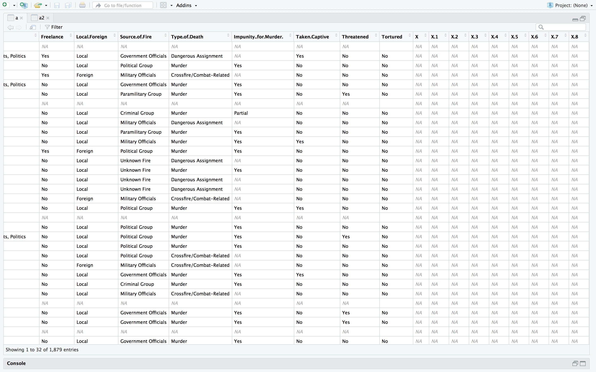

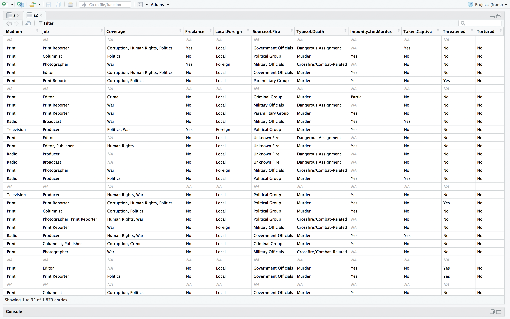

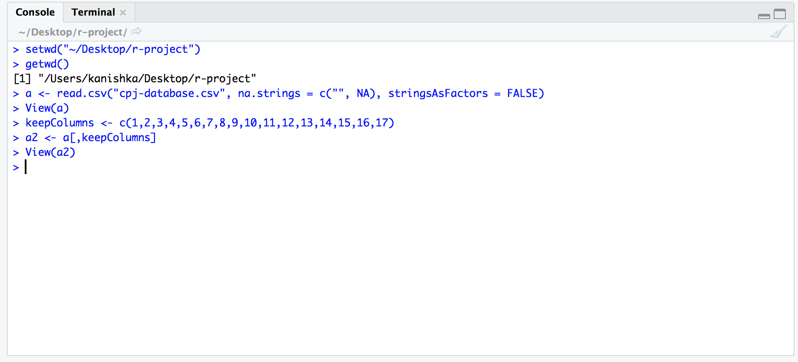

- **Removal of `blanks values` and `na`**

```r
> setwd("~/Desktop/r-project")
> getwd()
[1] "/Users/kanishka/Desktop/r-project"
> a <- read.csv("cpj-database.csv", na.strings = c("", NA), stringsAsFactors = FALSE)
> View(a)
> keepColumns <- c(1,2,3,4,5,6,7,8,9,10,11,12,13,14,15,16,17)
> a2 <- a[,keepColumns]
> View(a2)
> a3 <- na.omit(a2)
> View(a3)
> 
```

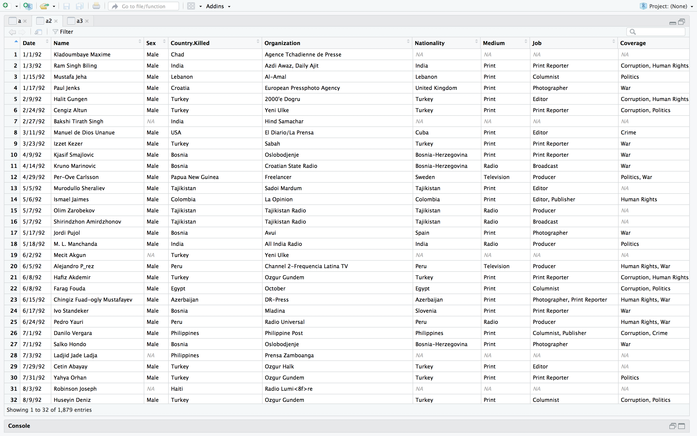

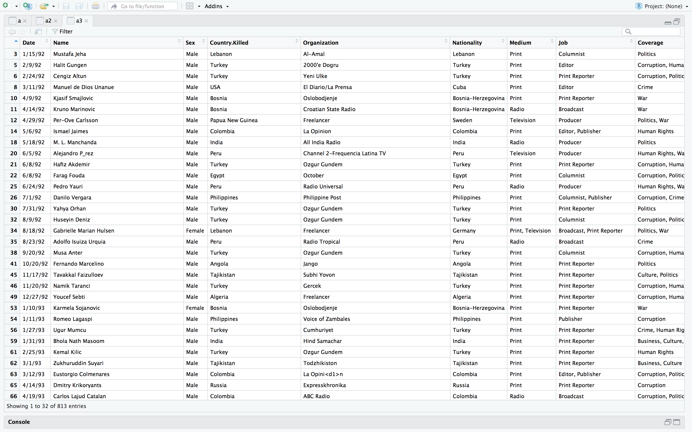

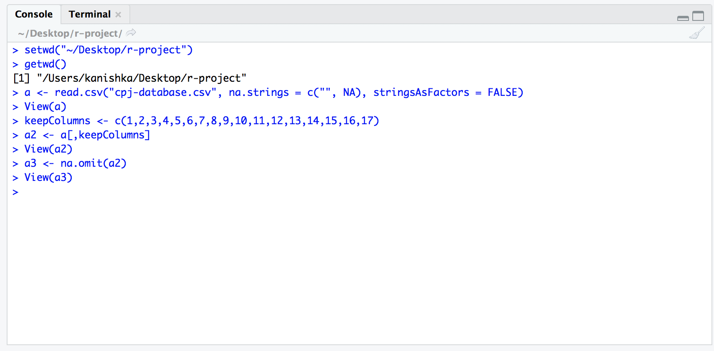

- **Splitting columns**

```r
> write.csv(a3, file = "cpj-database.csv",row.names=TRUE)
```

```r
> setwd("~/Desktop/r-project")
> getwd()
[1] "/Users/kanishka/Desktop/r-project"
> a <- read.csv("cpj-database-mod.csv")
> View(a)
> a4 <- separate(a, Date, c("day", "month", "year"), sep = "-")
> View(a4)
> 
```

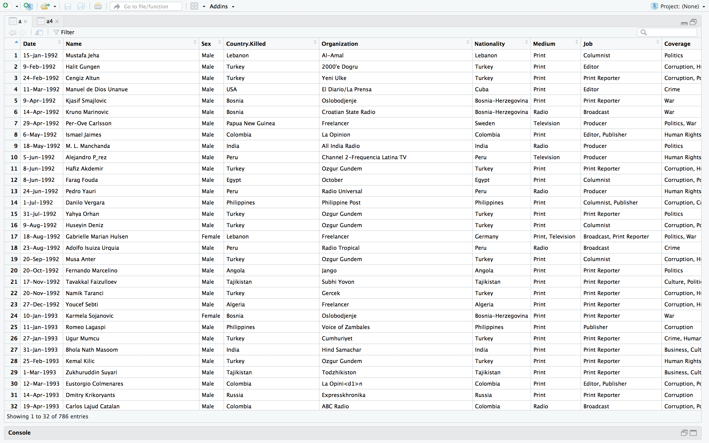

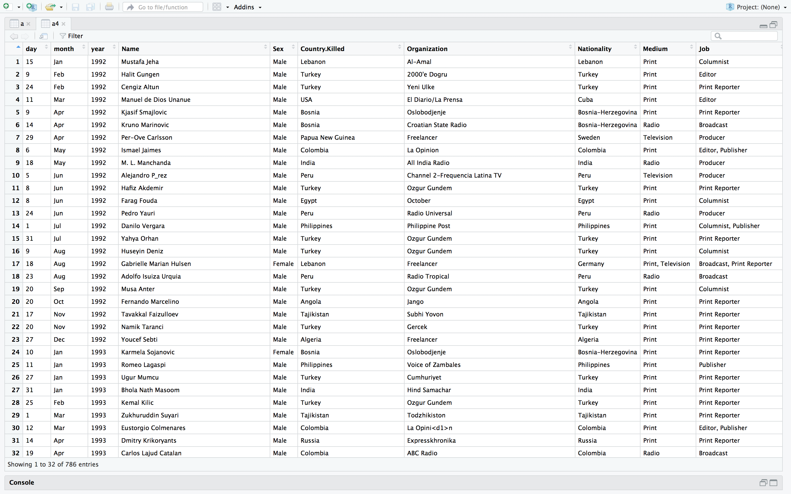

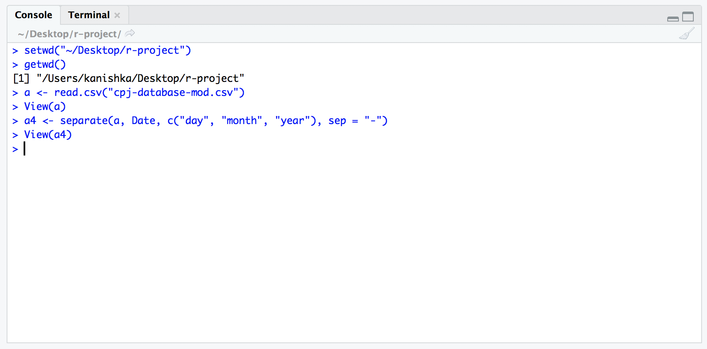

----

###### Visualization

- **Gender wise distribution of journalist deaths over the years**

```r
> setwd("~/Desktop/r-project")
> getwd()
[1] "/Users/kanishka/Desktop/r-project"
> a <- read.csv("cpj-database-mod.csv")
> View(a)
> a4 <- separate(a, Date, c("day", "month", "year"), sep = "-")
> View(a4)
> ggplot(a4, aes(x = year, fill = Sex)) + theme_bw() + geom_bar() + labs(y = "Count", title = "Gender wise distribution of journalist deaths over the years")
> 
```

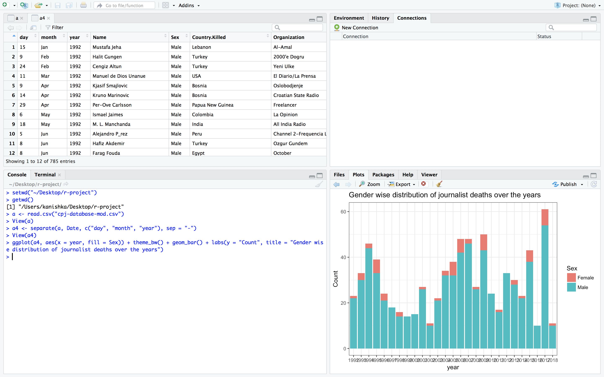

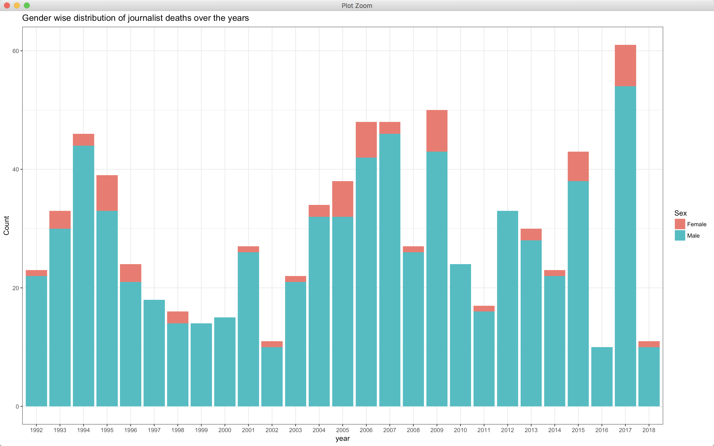

`gender-wise-dist.r`

```r
setwd("../dataset/")
getwd()
library(tidyr)
library(ggplot2)
a <- read.csv("cpj-database-mod.csv")
View(a)
a4 <- separate(a, Date, c("day", "month", "year"), sep = "-")
View(a4)
plot <- ggplot(a4, aes(x = year, fill = Sex)) + theme_bw() + geom_bar() + labs(y = "Count", title = "Gender wise distribution of journalist deaths over the years")
print(plot)
```

```r
> setwd("~/Desktop/Data-Analysis-of-Journalists-killed-since-1992/scripts")
> source("gender-wise-dist.r")
```

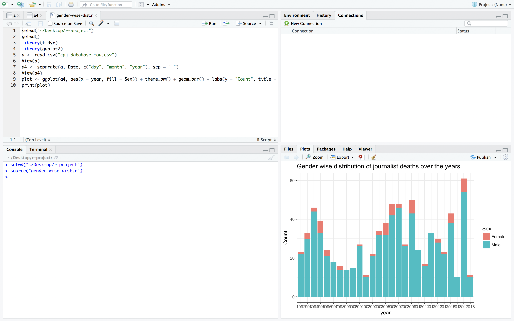

- **Are foreign journalists targeted more than local journalists?**

```r
> setwd("~/Desktop/r-project")
> getwd()
[1] "/Users/kanishka/Desktop/r-project"
> a <- read.csv("cpj-database-mod.csv")
> View(a)
> a4 <- separate(a, Date, c("day", "month", "year"), sep = "-")
> View(a4)
> local_and_foreign <- table(a4$Local.Foreign)
> View(local_and_foreign)
> pie(local_and_foreign, main = "Are foreign journalists targeted more than local journalists?", col = c('azure', 'darksalmon', 'cyan2'))
> 
```

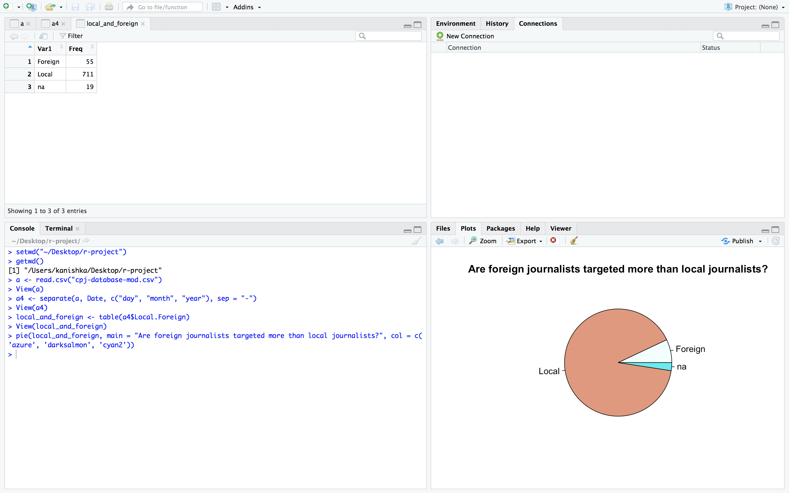

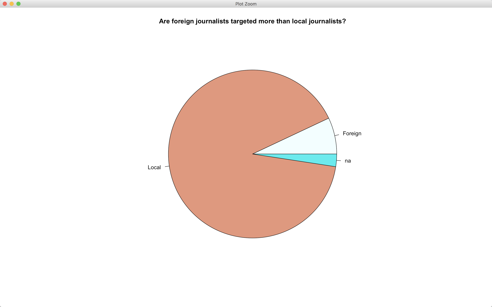

`are-foreign-journalists-targeted.r`

```r
setwd("../dataset/")
getwd()
library(tidyr)
a <- read.csv("cpj-database-mod.csv")
View(a)
a4 <- separate(a, Date, c("day", "month", "year"), sep = "-")
View(a4)
local_and_foreign <- table(a4$Local.Foreign)
View(local_and_foreign)
pie(local_and_foreign, main = "Are foreign journalists targeted more than local journalists?", col = c('azure', 'darksalmon', 'cyan2'))
```

```r
> setwd("~/Desktop/Data-Analysis-of-Journalists-killed-since-1992/scripts")
> source("are-foreign-journalists-targeted.r")
```

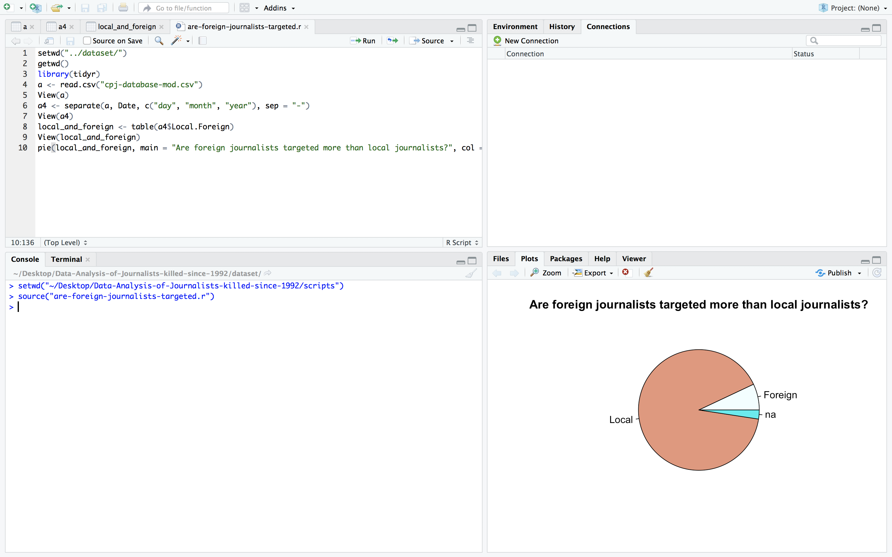